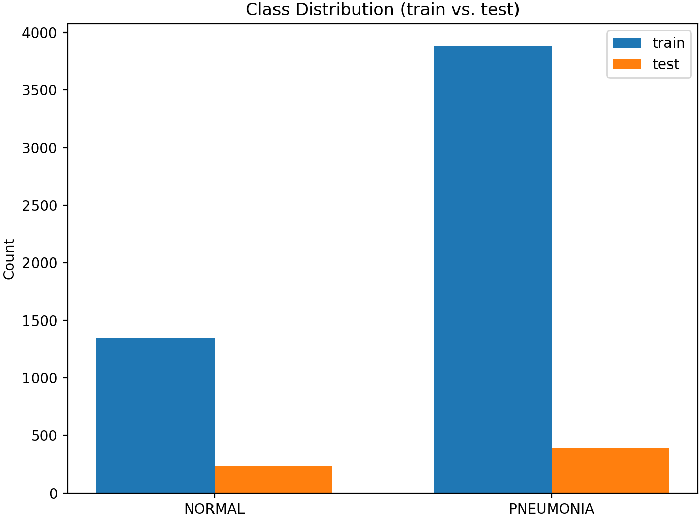
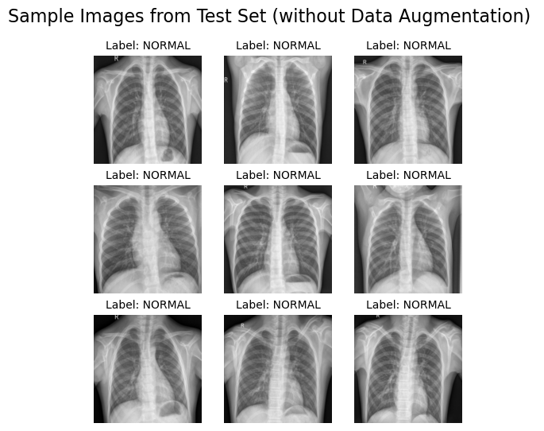
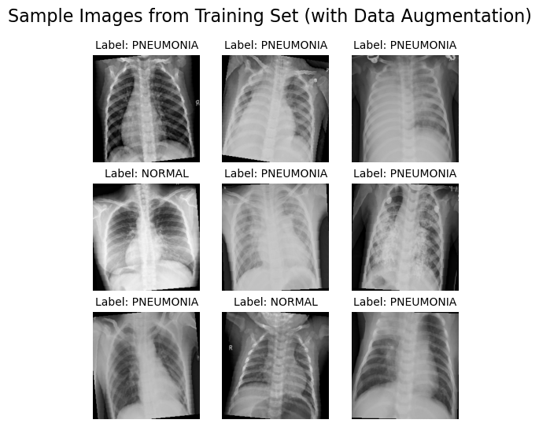
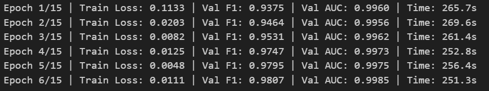
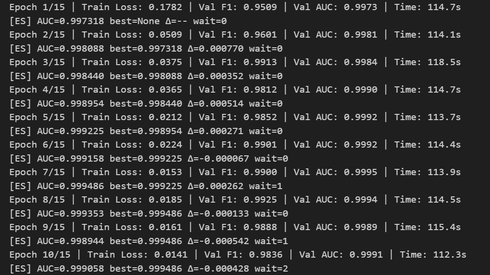
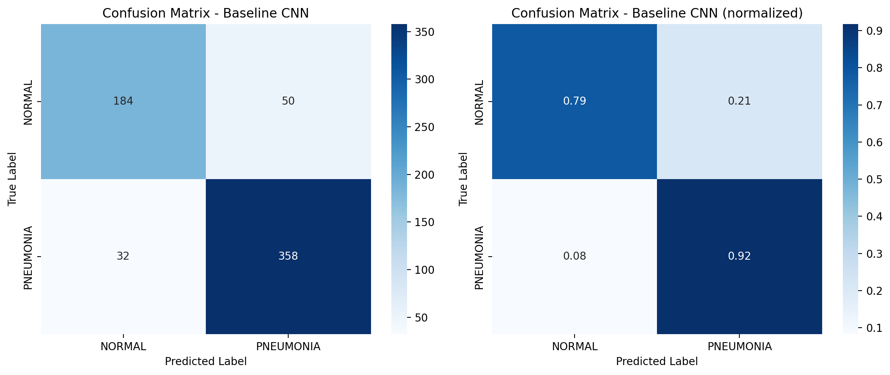
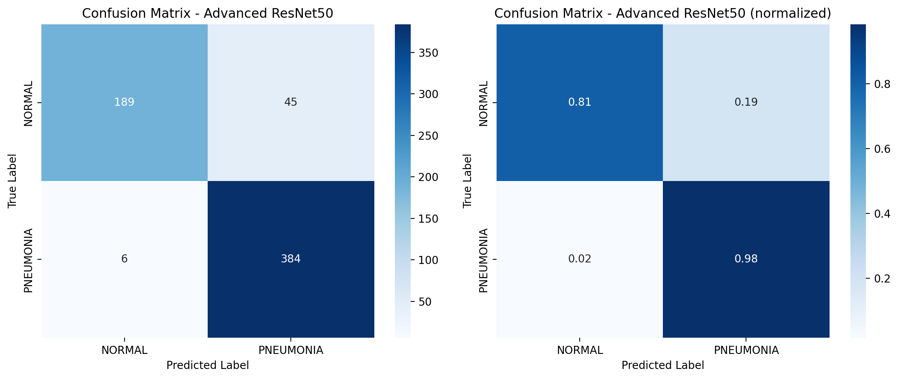
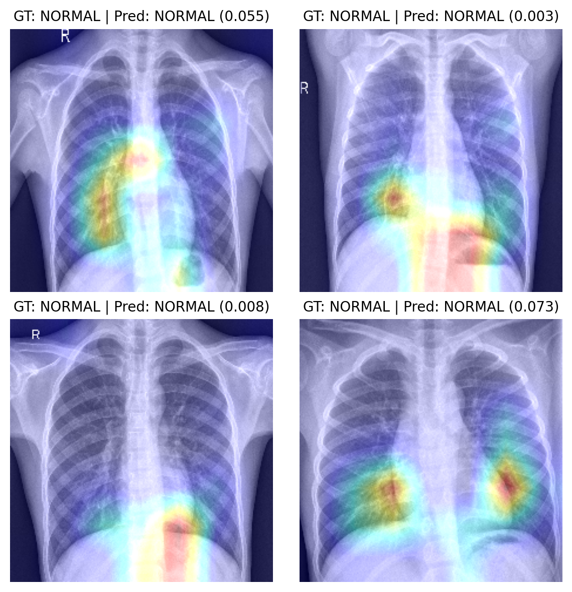

# AML_PROJECT_ADVANCED
Advanced AML project - Deep learning for chest X-ray classification (Pneumonia vs Normal)
# **Chest X-ray Image Classification: A Deep Learning Analysis**
**`Domain: Medical Imaging`**

I selected the dataset `Advanced - 1 Chest X-Ray Images for Classification` from the `Suggested Datasets` folder as the basis for my **AML-AD project**. This dataset was published by **University of California San Diego (UCSD)** and archived on the **Mendeley Data** platform.

The goal of this project is to build a deep learning model capable of processing large-scale chest X-ray data for binary classification of pneumonia (PNEUMONIA) versus normal (NORMAL).

**Technical features include:**     
- Following a complete machine learning workflow, implemented with the PyTorch framework.  
- Preprocessing of complex medical images.  
- Optimization strategies addressing challenges of storing and processing large-scale image data.  
- Handling class imbalance through weighted loss functions and improved sampling efficiency.

# **Experimental Setup and Implementation Details**  
Task: ChestXRay2017 binary classification (NORMAL vs PNEUMONIA).  
Technical features: Split into training/validation/testing sets, fixed global random seed to ensure reproducibility.

## **Models**  
**Baseline**: Lightweight CNN.  
**Advanced**: ResNet-50 (pretrained on ImageNet).  
**Modified classifier head**: `Linear(in_features→256) → ReLU → Dropout(0.5) → Linear(256→1)`  

## **Class Imbalance Handling**  
To address the imbalance in ChestXRay2017, where NORMAL samples are fewer than PNEUMONIA, I adopt both **sampling-based** and **loss-based** strategies simultaneously.

 

#### **1）Sampling-based: WeightedRandomSampler**
Idea: During sampling in the DataLoader, **increase the probability of selecting minority classes**, thereby balancing the class distribution of each mini-batch from the beginning.  

  
其中分别是正/负样本数  

#### **2）Loss-based: pos_weight in BCEWithLogitsLoss**
Idea: When computing the binary cross-entropy, assign **greater weight to positive (or minority) classes**, thereby strengthening the model’s learning signal for such classes.

*To avoid over-correction when using WeightedRandomSampler simultaneously, I applied a softened (sqrt) version*.

   

#### **3）Data preprocessing: resizing and normalization; no random augmentations applied to validation/testing sets.**  

  
  

## **Data Loading and Computational Efficiency**
*Balancing stability and runtime efficiency in data loading strategies*  
*(Environment: Windows, SSD, RTX 3070 Laptop)*  
#### **1） Optimal parameter configuration after repeated experiments:**  
`batch_size`：Set to 32 for each training step, balancing speed and GPU memory usage.  
`shuffle=False`：Data order not shuffled to avoid randomness in validation/testing.  
`num_workers=4`：Use 4 worker processes for parallel data loading to improve I/O efficiency.  
`prefetch_factor=4`：Each worker prefetches 4 batches, reducing wait time.  
`pin_memory=torch.cuda.is_available()`：Lock data into page-locked memory for faster transfer to GPU.  
`drop_last=False`：Retain the last incomplete batch to ensure all samples are included during evaluation.  

#### **2） Composite performance optimizations:**  
`AMP（Automatic Mixed Precision）` ：Mixed precision training to improve efficiency.  
`channels_last`：Tensor memory layout changed from the default NCHW to NHWC (channel dimension last).  
*Better optimized for GPU Tensor Core, especially in convolution operations.*  
`cuDNN benchmark`： cuDNN automatically tests available convolution algorithms and selects the fastest one.  
*Further accelerates convolution (especially when input sizes are fixed).*。  
Additionally,  
Enable **non-deterministic algorithms** (cudnn.deterministic = False).  
Allow **asynchronous data transfer** (CPU → GPU, non_blocking=True & pin_memory=True).  

#### **3）Achieving up to 2× higher computational efficiency:**  
**Computational efficiency:**  
With the same batch size, enabling **AMP + channels_last + multi-process DataLoader** significantly shortens per-epoch training time and improves GPU utilization.  
Advanced（before optimization）  
Per-epoch training time (s) ≈ 251–270  
  
Advanced（after optimization）  
Per-epoch training time (s) ≈ 116–126  
  
**Logs:**：  
Advanced, 6 epochs: 265.7 / 269.6 / 261.4 / 252.8 / 256.4 / 251.3 s  
Advanced, 10 epochs: 114.7 / 114.1 / 118.5 / 114.7 / 113.7 / 114.4 / 113.9 / 114.5 / 115.4 / 112.3 s  
**Conclusion**:  
Under the RTX 3070 environment, the overall speedup is approximately ~2×, and training becomes more stable.

## **Results Analysis**
#### **1）Thresholding strategy:**  
To reduce false decisions in clinical usage, I combined a *soft* cost-sensitive scoring objective with a *hard* safety constraint during threshold selection.  
The soft term encourages conservative thresholds that favor a higher TNR, while the hard constraint enforces **TNR ≥ 0.93** with a **minimum threshold ≥ 0.90**.  
This two-level design slightly trades TPR for markedly more reliable behavior.

**Why it matters for this dataset:**  
Given the strong class imbalance in *ChestXRay2017*, such combined constraints are necessary to **mitigate bias and stabilize performance**.  

#### **2）Key Findings of This Experiment:**  
*Baseline CNN* tends to over-predict Pneumonia, misclassifying many normal cases  
**→ Balanced Acc = 0.852，AUC = 0.922；TNR ≈ 0.786，TPR ≈ 0.918**。  
  
*Transfer learning with ResNet50* is **more robust**. While maintaining a **very high pneumonia recall (TPR ≈ 0.985)**, it also improves the correct recognition of normal cases **(TNR ≈ 0.808)**.  
**→ Balanced Acc increases to 0.896, AUC reaches 0.980**.  
→ At the tuned thresholds, **FN drops from 32 to 6 and FP decreases from 50 to 45**.  
  

With techniques such as **WeightedRandomSampler + pos_weight** for **class imbalance** handling, and **AMP + GPU acceleration**, the advanced model achieves **higher training efficiency** and **better generalization** compared to the baseline.  

Future Work:  
Plan to incorporate **external datasets** for further validation, refine the thresholding strategy, and further improve stability and clinical applicability.

#### **3）Explainability Analysis (Grad-CAM Observations):**  
1) *Primary Focus Is Reasonable*:  
High activations (red/yellow) concentrate in the **bilateral lung fields** and along the **cardiac silhouette**; low activations (blue/green) appear on clavicles/soft tissue—consistent with expected CXR focus.  
2) *Confidence Aligns with Visualization*:  
The value in parentheses is the **probability of NORMAL**; low values (e.g., 0.003–0.073) mean **higher confidence for NORMAL**. Maps focus on **clear lung parenchyma** with no spurious peaks.  
3) *Minor Non-Pulmonary Activations Are Typical Artifacts*:  
Mild activations near **diaphragmatic domes** or **cardiophrenic angles** are common weakly-supervised artifacts (edge/contrast effects) and do not affect conclusions.  
   

*Conclusion*:  
The model bases its **NORMAL** decision on **intra-pulmonary cues, without relying on irrelevant regions**—consistent with the strong TNR and AUC in this run.
**Limitations & Future Work**:  
Grad-CAM is low-resolution; future work may use **higher-resolution attention maps** or **box/segmentation supervision** to improve localization and interpretability.
